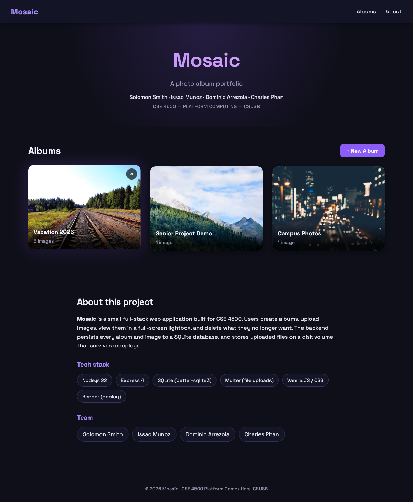
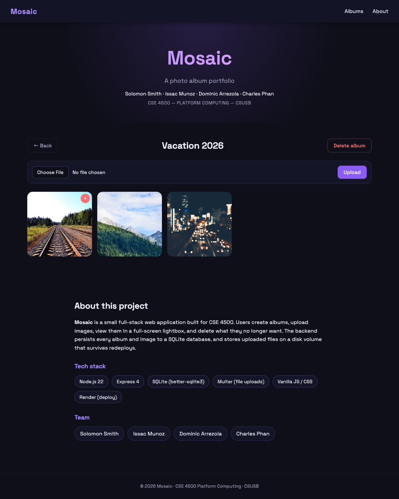
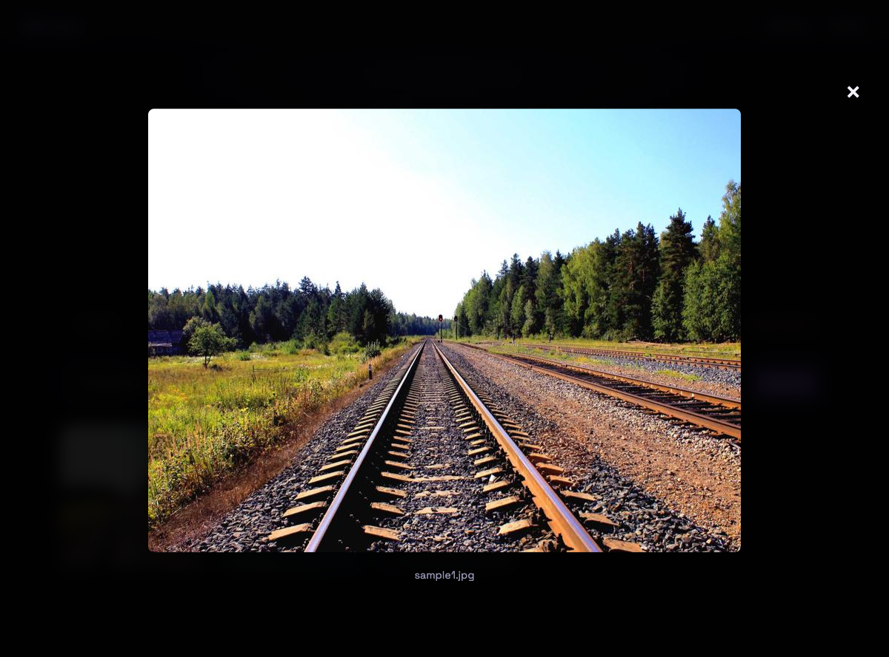

<!-- _class: title -->

# Mosaic
## A photo album portfolio

**CSE 4500 — Platform Computing**

Solomon Smith · Issac Munoz · Dominic Arrezola · Charles Phan

<span class="small">Live demo: _(filled in after Render deploy)_</span>

---

## The problem

The course covered HTML, CSS, JavaScript, Express.js and database
management as separate modules.

> The final project asks us to combine all of them into one application.

We chose a **photo album portfolio** because it exercises every layer:

- Styled, responsive frontend
- REST routes
- Multipart file uploads
- Relational schema with a foreign-key cascade
- Persistent file storage on deploy

---

## Architecture

```
Browser  ──HTTP──>  Express (Node 22)
                      │
                      ├─ GET    /api/albums          → SQLite
                      ├─ POST   /api/albums          → SQLite
                      ├─ DELETE /api/albums/:id      → SQLite + fs.unlink
                      ├─ POST   /api/upload          → multer + SQLite
                      ├─ DELETE /api/images/:id      → SQLite + fs.unlink
                      ├─ /uploads/*                  → static images
                      └─ /                           → static SPA
```

Two tables: `albums` and `images`, joined by `images.album_id`
with `ON DELETE CASCADE`.

---

## Live demo



---

## Live demo — gallery + lightbox

 

---

## Tech stack

| Layer       | Choice                                        |
|-------------|-----------------------------------------------|
| Runtime     | Node.js 22 (pinned in `.node-version`)        |
| Server      | Express 4                                     |
| Database    | SQLite via `better-sqlite3` (synchronous)     |
| Uploads     | Multer (10 MB cap, image-only filter)         |
| Frontend    | Vanilla JS + CSS (no framework, no innerHTML) |
| Deploy      | Render Blueprint with 1 GB persistent disk    |

---

## Validation

The backend returns JSON error envelopes the frontend shows as toasts:

| Scenario                          | Status |
|-----------------------------------|--------|
| Duplicate album name              | 409    |
| Empty album name                  | 400    |
| Non-image upload                  | 400    |
| Upload > 10 MB                    | 400    |
| Upload to nonexistent album       | 404    |
| Delete missing image / album      | 404    |

If the album check fails *after* multer has already written a temp
file, the route unlinks the orphan before responding.

---

## Lessons learned

- **Native modules pin the runtime.** `better-sqlite3` is compiled
  against a specific Node ABI — `.node-version` documents the pin.
- **SQLite foreign keys are off by default.** Without
  `PRAGMA foreign_keys = ON;` cascading deletes silently no-op.
- **Multer writes before your route runs.** Validate cleanup paths.
- **`textContent` beats sanitizing `innerHTML`.** Structural XSS
  prevention with zero dependencies.

---

## Team

Mosaic is a joint effort by all four team members.
Every member contributed across the stack.

- **Solomon Smith**
- **Issac Munoz**
- **Dominic Arrezola**
- **Charles Phan**

---

<!-- _class: title -->

# Questions?

Repository: <span class="small">github.com/.../cse-4500-final-project</span>
Live demo: <span class="small">_(Render URL)_</span>

Thank you.
